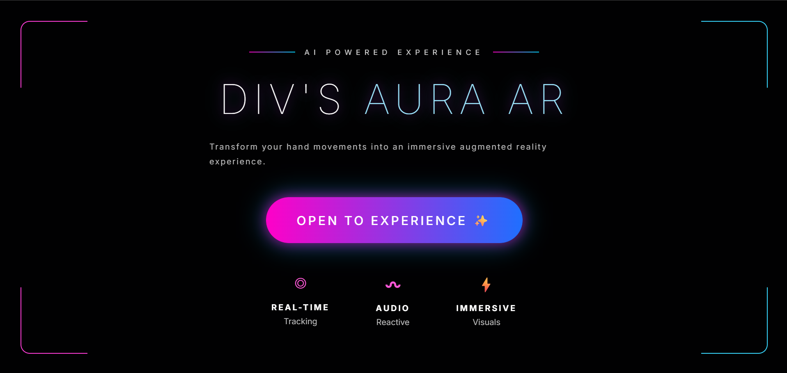
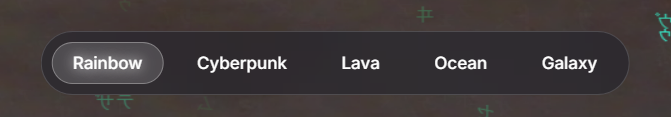

<div align="center">

# ✨ HandConnectDiv

### AI-Powered Hand Tracking Experience using MediaPipe & HTML5 Canvas



<br>

[](https://hand-connect-div.vercel.app/)
[](https://github.com/sinhadivyanshi22/HandConnectDiv)


</div>

---

# 🌐 Live Demo

## https://hand-connect-div.vercel.app/

Experience real-time AI hand tracking directly in your browser.

---

# 📖 About

HandConnectDiv is an interactive browser-based application that combines **Google MediaPipe Hands**, **HTML5 Canvas**, and **JavaScript** to create a futuristic hand-tracking experience.

The application detects hand landmarks in real time and renders glowing particles, rainbow connectors, lightning effects, gesture detection, shockwaves, and dynamic visual themes.

Everything runs entirely inside the browser without requiring any backend.

---

# ✨ Features

## 🤖 AI Hand Tracking

- Real-time hand landmark detection
- Supports up to 2 hands
- Finger tip tracking
- Smooth tracking pipeline
- Gesture recognition

---

## 🎨 Visual Effects

- Neon hand skeleton
- Rainbow connector lines
- Dynamic particle engine
- Shockwave animations
- Lightning interaction between both hands
- Matrix-inspired animated background
- Bloom lighting effects

---

## 🎵 Audio System

- Ambient background hum
- Gesture-triggered sound effects
- Distance-based audio modulation

---

## 🎮 Gesture Detection

✔ Pinch Detection

✔ Open Hand Detection

✔ Fist Detection

✔ Hand Spread Percentage

---

## 🌈 Themes

- Rainbow
- Cyberpunk
- Lava
- Ocean
- Galaxy

---

# 🖼 Screenshots

## Landing Page


---

## Hand Tracking


---

## Interactive Effects



---

# ⚙ Technologies Used

- HTML5
- CSS3
- JavaScript (ES6)
- Google MediaPipe Hands
- HTML5 Canvas API
- Web Audio API
- Vercel

---

# 🚀 Getting Started

Clone the repository

```bash
git clone https://github.com/sinhadivyanshi22/HandConnectDiv.git
```

Move into the project

```bash
cd HandConnectDiv
```

Open

```text
index.html
```

or launch using VS Code Live Server.

---

# 💻 How It Works

### Camera

The application starts by requesting camera permission.

### MediaPipe

Google MediaPipe detects 21 landmarks for each hand.

### Rendering

HTML5 Canvas renders

- Hand skeleton
- Particles
- Rainbow connectors
- Shockwaves
- Matrix background

### Physics Engine

Particles and ripples are updated every animation frame using JavaScript.

### Audio Engine

Audio responds dynamically to hand movement and gestures.

### Theme Engine

Users can switch between five visual themes during runtime.

---

# 📈 Future Enhancements

- Cursor ribbon effects
- Advanced AR overlays
- Gesture-based UI navigation
- Mobile optimization
- Performance improvements
- Additional themes

---

# 👩‍💻 Developer

## Divyanshi Sinha

Aspiring Software Developer

- GitHub: https://github.com/sinhadivyanshi22
- Live Demo: https://hand-connect-div.vercel.app/

---

<div align="center">

⭐ If you enjoyed this project, please consider giving it a star.

Made with ❤️ by Divyanshi Sinha

</div>
